# ANEXO - Diagrama HIPO actualizado (Biblioteca Virtual)

## 1. Alcance del anexo

Este anexo presenta el HIPO del **backend/API** del sistema Biblioteca Virtual.
Se adopta una versión compacta y formal, con **19 procesos IPO** (rango solicitado: 15-20),
manteniendo trazabilidad con los endpoints reales implementados.

## 2. Jerarquía HIPO (H)

```mermaid
flowchart TD
    A[Backend Biblioteca Virtual] --> B[Autenticacion y gestion de usuarios]
    A --> C[Catalogo academico]
    A --> D[Prestamos e historial]
    A --> E[Convocatorias]
    A --> F[Inteligencia artificial]
    A --> G[Estadisticas]
    A --> H[Servicios transversales]

    B --> B1[Login token]
    B --> B2[Usuarios]
    B --> B3[Roles]
    B --> B4[Perfiles]

    C --> C1[Autores]
    C --> C2[Palabras clave]
    C --> C3[Clasificaciones]
    C --> C4[Libros]
    C --> C5[Trabajos de investigacion]

    D --> D1[Solicitudes de prestamo]
    D --> D2[Resolucion de solicitudes]
    D --> D3[Historial de visualizacion]

    E --> E1[Gestion de convocatorias]

    F --> F1[Busqueda semantica]
    F --> F2[Respuesta RAG]
    F --> F3[Analitica de tendencias IA]

    G --> G1[Indicadores de tendencias]
    G --> G2[Trabajos por mes]

    H --> H1[Documentacion API]
    H --> H2[Servicio PDF inline]
```

## 3. Matriz IPO compacta (19 procesos)

| # | Proceso (I) | Proceso interno (P) | Salida (O) |
|---:|---|---|---|
| 1 | Credenciales de usuario (`api-token-auth`) | Validación y emisión de token DRF | Token de acceso o error |
| 2 | Datos de usuario (`users`) | Registro público y gestión administrativa | Usuario creado/actualizado/eliminado |
| 3 | Datos de rol (`roles`) | Control de roles con permisos por jerarquía | Catálogo de roles vigente |
| 4 | Datos de perfil (`perfiles`) | Gestión de perfil propio o global según privilegio | Perfil(es) de usuario |
| 5 | Datos de autor (`autores`) | Alta/edición/baja con reglas por rol | Autores normalizados |
| 6 | Términos (`palabras-clave`) | Gestión semántica de términos | Palabras clave disponibles |
| 7 | Clasificación bibliográfica (`clasificaciones`) | Gestión Dewey/Cutter | Clasificación persistida |
| 8 | Parámetros de búsqueda (`libros`) | Filtro por título y palabras clave | Inventario de libros físicos |
| 9 | Metadatos y filtros (`trabajos`) | CRUD de trabajos y consulta avanzada | Repositorio de trabajos actualizado |
| 10 | Formulario + PDF (`trabajos/subir_trabajo`) | Validación transaccional y persistencia | Trabajo cargado o error validado |
| 11 | Idea de investigación (`trabajos/validar_tema`) | Evaluación de originalidad con IA | Resultado de validación temática |
| 12 | ID de trabajo (`trabajos/{id}/recomendaciones`) | Cálculo de similitud documental | Lista de trabajos recomendados |
| 13 | Pregunta + ID (`trabajos/{id}/chat_ia`) | Recuperación de contexto PDF y respuesta IA | Respuesta contextual al usuario |
| 14 | Datos de solicitud (`solicitudes`) | Registro y gestión de préstamos con visibilidad por rol | Solicitudes con estado |
| 15 | Acción staff (`solicitudes/{id}/aprobar|rechazar`) | Resolución de solicitud por bibliotecario/director | Estado final aprobado/rechazado |
| 16 | Evento de consumo (`historial`) | Registro de visualización e IP de origen | Trazabilidad de uso del repositorio |
| 17 | Datos de convocatoria (`convocatorias`) | Gestión de publicación por rol autorizado | Convocatorias vigentes/históricas |
| 18 | Consultas estadísticas (`estadisticas/*`) | Agregación temporal y temática institucional | Indicadores y series para dashboard |
| 19 | Consulta IA (`ia/search`, `ia/rag`, `ia/analytics/trends`) | Búsqueda semántica, generación RAG y clustering | Resultados IA, fuentes y tendencias |

## 4. Nota metodológica

Esta versión compacta no enumera cada verbo HTTP por separado, pero sí cubre todos
los flujos funcionales relevantes del backend actual. Esto mejora legibilidad académica
sin perder cobertura de entradas y salidas del sistema.

## 5. Trazabilidad técnica

- `backend/biblioteca/urls.py`
- `backend/ia_core/urls.py`
- `backend/biblioteca/views/*.py`
- `backend/ia_core/views.py`
- `backend/biblioteca/views/pdf.py`
